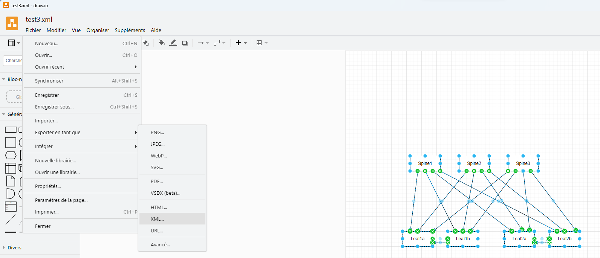

# Draw.IO-to-ContainerLab

## Introduction
Draw a network diagram on DrawIO and generate a yml file for ContainerLab

## Installation

### Simple usage
Step 1: Draw your network


Step 2: Export your network
Export from DrawIO the schemas in XML



Step 3: Choose your binary
- Windows : drawIOContainerLab.exe
- Linux : drawIOContainerLab

Step 4: Use it
```
go run main.go -h
Usage of /tmp/go-build1086981949/b001/exe/main:
  -i string
        image version of the code (default "4.30.3M")
  -s string
        source file name (default "default.xml")
  -t string
        target file name (default "default.yml")
```

Exemple: drawIOContainerLab.exe -s test3.xml
```
name: lab
topology:
  kinds:
    ceos:
      image: arista/ceos:4.30.3M
  nodes:
    Spine1:
      kind: ceos
    Spine2:
      kind: ceos
    Spine3:
      kind: ceos
    Leaf1a:
      kind: ceos
    Leaf1b:
      kind: ceos
    Leaf2a:
      kind: ceos
    Leaf2b:
      kind: ceos
  links:
    - endpoints: ["Spine1:eth1","Leaf1a:eth1"]
    - endpoints: ["Spine1:eth2","Leaf1b:eth1"]
    - endpoints: ["Spine1:eth3","Leaf2a:eth1"]
    - endpoints: ["Spine1:eth4","Leaf2b:eth1"]
    - endpoints: ["Spine2:eth1","Leaf1a:eth2"]
    - endpoints: ["Spine2:eth2","Leaf1b:eth2"]
    - endpoints: ["Spine2:eth3","Leaf2b:eth2"]
    - endpoints: ["Spine3:eth1","Leaf1b:eth3"]
    - endpoints: ["Spine3:eth2","Leaf1a:eth3"]
    - endpoints: ["Leaf1a:eth4","Leaf1b:eth4"]
    - endpoints: ["Leaf1b:eth5","Leaf1a:eth5"]
    - endpoints: ["Leaf2a:eth2","Leaf2b:eth3"]
    - endpoints: ["Leaf2b:eth4","Leaf2a:eth3"]
    - endpoints: ["Spine2:eth4","Leaf2a:eth4"]
    - endpoints: ["Spine3:eth3","Leaf2b:eth5"]
    - endpoints: ["Spine3:eth4","Leaf2a:eth5"]
```

### Fun usage
#### Prerequisite
It is my first software in Go !!

```
go version
go version go1.21.5 linux/amd64
```

```
git clone https://github.com/fbd1789/Draw.IO-to-ContainerLab.git
```