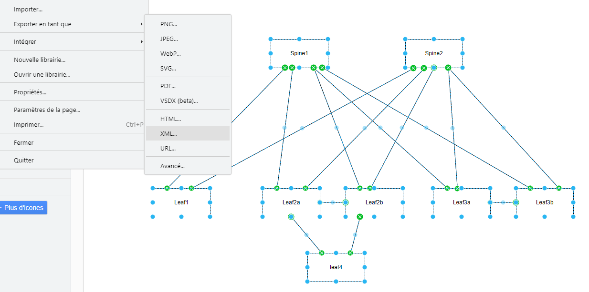

# Draw.IO-to-ContainerLab

## Introduction

This project allows you to draw a network diagram in **DrawIO**, and then generate a YAML file compatible with **ContainerLab** to simulate this network.

## Features

- Draw a network in Draw.IO.
- Export it as XML.
- Use the Go program to convert the export into a YAML file for **ContainerLab**.

## Installation

### Prerequisites

You need to have Go installed to compile and use the program.

- Verify that Go is installed on your machine:
    ```bash
    go version
    ```

### Clone the project

Clone the Git repository to your local machine:

```bash
git clone https://github.com/your-username/Draw.IO-to-ContainerLab.git
```

### Compilation

Navigate to the project directory and compile the Go program:

```bash
cd Draw.IO-to-ContainerLab
go build main.go
```

This will generate an executable that can be used to convert XML files to YAML files for **ContainerLab**.

## Usage

### Step 1: Draw your network

Create a diagram of your network using Draw.IO.

Network example:


### Step 2: Export the diagram

Once the diagram is drawn, export it in XML format from Draw.IO.

- Go to **File** → **Export as** → **XML**:



### Step 3: Generate the YAML file

After exporting the XML, use the generated executable to convert this file into a YAML file compatible with **ContainerLab**.

- Edit the `config.ini` file with the specific details of your network.

Example `config.ini`:
```ini
[global]
nameLab = MyLab
fileSrcXml = ExportXML.xml

[mgmt]
ipv4Subnet = 172.20.20.0/24

[topology]
image = 4.30.3M

[nodes]
vrf = MGMT
```

- Then, run the program:
    ```bash
    ./versionLinux_v1
    ```
    or for windows:
    ```bash
    ./versionWindows_v1.exe
    ```

This will generate a `config.yaml` file in a directory named according to the `[global]` name specified in the `config.ini`.

Example of the generated YAML file:
```yaml
name: MyLab
mgmt:
    network: MyLab-mgmt
    ipv4-subnet: 172.20.20.0/24
topology:
    kinds:
        ceos:
            image: arista/ceos:4.30.3M
            binds:
                - ./cv-onboarding-token:/mnt/flash/cv-onboarding-token
    nodes:
        Leaf1:
            kind: ceos
            mgmt-ipv4: 172.20.20.4
            env:
                CLAB_MGMT_VRF: MGMT
            binds:
                - configs/ceos-config/Leaf1.cfg:/mnt/flash/ceos-config:ro
        Leaf2a:
            kind: ceos
            mgmt-ipv4: 172.20.20.5
            env:
                CLAB_MGMT_VRF: MGMT
            binds:
                - configs/ceos-config/Leaf2a.cfg:/mnt/flash/ceos-config:ro
```

## Provided Files

- **DrawIOExample.png** : An example Draw.IO diagram.
- **DrawIOExample1.png** : Illustration of exporting as XML in Draw.IO.
- **example.xml** : Example XML file exported from Draw.IO.
- **config.ini** : Example configuration file used to generate the YAML file.
- **main.go** : The Go program to generate YAML files from the XML file.
- **versionLinux_v1** : Compiled version for linux or mac
- **versionWindows_v1** : Compiled version for windows

## Author

Bee nice it is my first soft in Go
