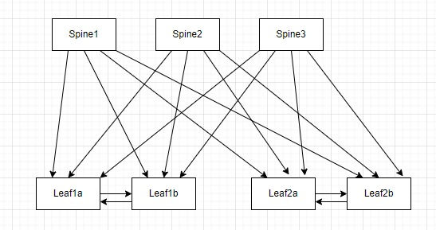

# Draw.IO-to-ContainerLab

## Introduction
Draw a network diagram on DrawIO and generate a yml file for ContainerLab

## Installation
### Prerequisite
```
go version
go version go1.21.5 linux/amd64
```
### Simple usage
