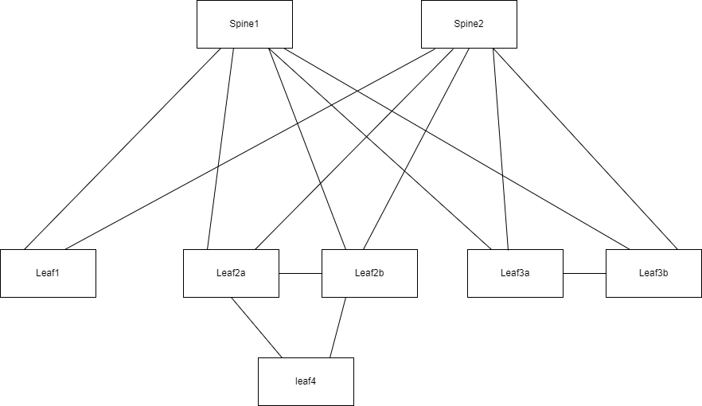

# Draw.IO-to-ContainerLab

## Introduction
Draw a network diagram on DrawIO and generate a yml file for ContainerLab

## Installation

### Simple usage
Step 1: Draw your network



Step 2: Export your network
Export from DrawIO the schemas in XML


Step 3: Choose your binary
- Windows : versionWindows.exe
- Linux : versionLinux

Step 4: Use it
```
Define the information that needed in the config.ini file
[global]
nameLab = MonLab
fileSrcXml = ExportXML.xml

[mgmt]
ipv4Subnet = 172.20.20.0/24

[topolgy]
image = 4.30.3M

[nodes]
vrf = MGMT
```

Step 5:
A directory is created with the "NameLab"
Inside the directory you will find the config.yaml for containerLab abd all the file for CEOS


Exemple: versionWindows.exe
A config.yaml is generated for the containerLab
```
name: MonLab
mgmt:
    network: MonLab-mgmt
    ipv4-subnet: 172.20.20.0/24
topology:
    kinds:
        ceos:
            image: arista/ceos:4.30.3M
            binds:
                - ./cv-onboarding-token:/mnt/flash/cv-onboarding-token
    nodes:
        Leaf1:
            kind: ceos
            mgmt-ipv4: 172.20.20.4
            env:
                CLAB_MGMT_VRF: MGMT
            binds:
                - configs/ceos-config/Leaf1.cfg:/mnt/flash/ceos-config:ro
        Leaf2a:
            kind: ceos
            mgmt-ipv4: 172.20.20.5
            env:
                CLAB_MGMT_VRF: MGMT
            binds:
                - configs/ceos-config/Leaf2a.cfg:/mnt/flash/ceos-config:ro
        Leaf2b:
            kind: ceos
            mgmt-ipv4: 172.20.20.6
            env:
                CLAB_MGMT_VRF: MGMT
            binds:
                - configs/ceos-config/Leaf2b.cfg:/mnt/flash/ceos-config:ro

        Spine2:
            kind: ceos
            mgmt-ipv4: 172.20.20.3
            env:
                CLAB_MGMT_VRF: MGMT
            binds:
                - configs/ceos-config/Spine2.cfg:/mnt/flash/ceos-config:ro
    links:
        - endpoints: ['Leaf1:eth1', 'Spine1:eth1']
        - endpoints: ['Leaf1:eth2', 'Spine2:eth1']
        - endpoints: ['Leaf2a:eth1', 'Spine1:eth2']
        - endpoints: ['Leaf2a:eth2', 'Spine2:eth2']
 
```

### Fun usage
#### Prerequisite
It is my first software in Go !!

```
go version
go version go1.21.5 linux/amd64
```

```
git clone https://github.com/fbd1789/Draw.IO-to-ContainerLab.git
```